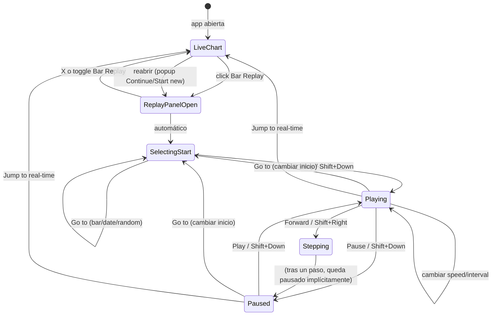

# TradingView Bar Replay — Referencia para implementación

> Documento de investigación para que un agente arquitecto/implementor calque el sistema
> Bar Replay de TradingView en el proyecto EPN (Perl/Tk).
>
> **Fecha de investigación:** 2026-07-04  
> **Fuentes:** documentación oficial TradingView, blogs del equipo TV (2020–2025), artículos de soporte.

---

## Propósito de este documento

Este archivo consolida **cómo funciona Bar Replay en TradingView**: flujo de usuario, controles del panel, atajos de teclado, intervalos, limitaciones, y comparación con la implementación actual del proyecto EPN.

Úsalo como **spec de referencia UX** al rediseñar la pestaña/botones de Replay en `market.pl`, `Market/UI/Callbacks.pm`, `Market/ChartEngine.pm` y `Market/ReplayController.pm`.

---

## 1. Qué es y para qué sirve

**Bar Replay** es el simulador histórico de **Supercharts** (el chart principal de TradingView). Permite:

- Elegir un punto del pasado y **revelar velas hacia adelante** como si el mercado avanzara en tiempo real.
- Probar estrategias, indicadores y dibujos **sin riesgo financiero**.
- Ajustar **velocidad de reproducción** y **intervalo de actualización** (cuánto tiempo real representa cada “tick” del replay).
- Pausar y **retomar la sesión** más adelante (desde octubre 2025).

**No es lo mismo que Paper Trading normal:** en replay estándar, las cotizaciones del panel de trading siguen siendo **tiempo real**. El modo **Replay Trading** es aparte y sí opera sobre datos históricos.

### Beneficios documentados por TradingView

| Beneficio | Descripción |
|-----------|-------------|
| Refinamiento de estrategia | Analizar comportamiento histórico y simular trades |
| Aprendizaje realista | Condiciones de mercado simuladas |
| Insights históricos | Patrones y tendencias del pasado |
| Práctica sin riesgo | Sin exposición financiera real |
| Velocidad variable | Control del ritmo de aprendizaje |
| Continuidad | Pausar y retomar sesión con configuración preservada |

---

## 2. Flujo general de uso

```
[Botón "Bar Replay" en barra superior del chart]
        ↓
[Se abre panel de replay flotante]
        ↓
[El chart entra automáticamente en modo "elegir punto de inicio"]
        ↓
[Usuario fija punto de inicio (bar / fecha / random / primer día)]
        ↓
[Play → avance automático barra a barra (o por intervalo configurado)]
        ↓
[Jump to real-time / cerrar panel → vuelta a datos en vivo]
```

### Entrada al modo replay

- Botón **Bar Replay** en el **panel superior** del chart (icono de rebobinar / retroceso de vídeo).
- Al pulsarlo: aparece el **panel de controles de replay** y el chart pasa a modo selección de inicio.
- **Cerrar el panel:** botón **X** del panel, o volver a pulsar el botón **Bar Replay**.

### Indicador visual de estado activo

- Icono/símbolo de replay visible en el chart mientras está activo.
- En modo selección de inicio: al mover el cursor sobre el chart aparece una **línea vertical azul con icono de tijeras** (scissors).

---

## 3. Panel de controles (barra tipo reproductor multimedia)

TradingView describe los botones como “intuitivos, como en cualquier media player”. Orden aproximado de izquierda a derecha:

| Control | Función |
|---------|---------|
| **Menú de tiempo / Go to…** | Cambiar punto de inicio (incluso con replay ya en curso) |
| **Play / Pause** | Inicia o pausa la reproducción automática |
| **Forward** | Avanza **un paso** manual (una unidad según el intervalo de replay) |
| **Velocidad (Speed)** | Multiplicador de velocidad del autoplay (ajustable antes y durante) |
| **Intervalo de replay** | Cuánto tiempo cubre cada tick (feature desde feb 2025) |
| **Jump to real-time chart** | Sale del replay y vuelve al chart en vivo al instante |
| **X** | Cierra el panel de replay |

### Nota importante sobre Step Back

La documentación oficial **no documenta** un botón “Step Back” ni atajo de teclado para retroceder una vela. La comunidad ha solicitado esta función repetidamente (Reddit 2024–2025). **No aparece** en la ayuda oficial ni en los hotkeys publicados.

---

## 4. Selección del punto de inicio (menú “Go to…” / timing menu)

Al abrir Bar Replay, el chart entra **directamente** en modo selección. Opciones del menú desplegable:

### A) Select bar

- Activa selección manual en el chart.
- Cursor sobre el chart → línea azul con tijeras.
- **Click en una vela** → esa fecha/hora queda como punto de inicio del replay.
- Se puede cambiar en cualquier momento vía **Go to… → Select bar**, incluso durante el replay.

### B) Select date…

- Abre un **calendario** para elegir fecha y hora.
- El replay salta a la **vela más cercana** a esa fecha/hora.
- Sub-opción: **Select the first available day** → salta a la primera vela disponible según símbolo, timeframe y plan de suscripción.

### C) Random bar

- Elige un punto de inicio **aleatorio** dentro del rango de datos disponible para replay.

### Comportamiento defensivo

- Si el punto elegido está demasiado atrás y no hay datos → salto automático a la **primera vela disponible**.
- **Truco documentado:** elegir inicio en un TF alto (ej. Daily), luego cambiar a 1m y dar Play para acceder a intradía antiguo dentro de los límites del plan.

### Mensaje “Data point unavailable”

Si se cambia de TF alto a bajo y no hay datos intradía tan atrás: mensaje en esquina inferior izquierda y el TF **no cambia**. Solución: usar Select date → Select the first available day en un punto donde exista intradía.

---

## 5. Velocidad vs intervalo de replay (dos conceptos distintos)

### 5.1 Velocidad (Speed)

- Controla **qué tan rápido** avanza el autoplay (multiplicador temporal entre ticks).
- Ajustable **antes y durante** la reproducción.
- Los valores exactos del dropdown (1x, 2x, 5x, etc.) **no están listados** en la documentación de soporte; solo se indica que es configurable.

### 5.2 Intervalo de replay (Replay interval) — desde febrero 2025

- Define **cuántos datos** se añaden por cada tick del replay.
- Ejemplo: si el intervalo es 5 minutos, cada tick añade el equivalente a 5 minutos de datos reales.
- Se muestra en el panel de controles, **a la derecha del control de velocidad**.
- Click en el intervalo abre menú con opciones disponibles para ese chart.

**Mínimos por tipo de chart:**

| Tipo de chart | Intervalo mínimo de replay |
|---------------|---------------------------|
| Segundos | 1 segundo |
| Intradía y diario | 1 minuto |
| Semanal / mensual | Solo intervalos de 1 día |

**Opciones de auto-selección:**

| Opción | Comportamiento |
|--------|----------------|
| **Same as chart** | El intervalo de replay coincide con el TF del chart |
| **Auto select interval** | En single-chart: TF del chart; en multi-chart: mayor intervalo común |
| **Max available** | En multi-chart con TF distintos: mayor resolución común para todos |

**Multi-chart:** los intervalos disponibles dependen del **menor TF** de todos los charts y deben **dividir** equitativamente los TF de cada chart.

Ejemplo documentado:
- AAPL 5m + AAPL 1D → intervalos disponibles: 1m y 5m.
- AAPL 2m + AAPL 17m → solo 1m (único valor que divide ambos).

**Intervalo de 1 segundo:** disponible en charts intradía desde agosto 2025 para planes **Premium y superiores**.

---

## 6. Atajos de teclado oficiales

Documentados en el [blog oficial sep 2020](https://www.tradingview.com/blog/en/hotkeys-for-the-bar-replay-20594/) y en la [guía principal](https://www.tradingview.com/support/solutions/43000712747-bar-replay-how-and-why-to-test-a-strategy-in-the-past/):

| Atajo | Acción |
|-------|--------|
| **Shift + ↓** (flecha abajo) | **Play / Pause** — alternar reproducción |
| **Shift + →** (flecha derecha) | **Avanzar un paso** — equivalente al botón Forward |

### No documentados oficialmente

- **Shift + ←** (retroceder un paso)
- Atajos para Select Bar, Random bar, Jump to real-time
- Atajos para cambiar velocidad o intervalo de replay
- Atajos para abrir/cerrar el panel de replay

---

## 7. Play, Pause y avance manual

| Acción | Control UI | Atajo teclado |
|--------|-----------|---------------|
| Iniciar/pausar autoplay | Botón Play/Pause (toggle) | Shift + ↓ |
| Avanzar 1 paso | Botón **Forward** | Shift + → |
| Retroceder 1 paso | **No documentado** en TV | — |

Durante el replay activo se puede:

- Cambiar la **velocidad**.
- Cambiar el **intervalo de replay**.
- Cambiar el **punto de inicio** (Go to…).
- **Pausar** en cualquier momento y retomar después.

---

## 8. Salir del replay y restauración de sesión

### Formas de salir

| Acción | Efecto |
|--------|--------|
| **Jump to real-time chart** | Vuelve al chart en vivo **al instante** (datos actuales del mercado) |
| **X** en el panel | Cierra el panel; la sesión se guarda automáticamente |
| Pulsar **Bar Replay** otra vez | Cierra el panel (toggle) |

### Restauración de sesión (desde octubre 2025)

Al salir y volver a abrir Bar Replay, aparece popup con dos opciones:

| Opción | Comportamiento |
|--------|----------------|
| **Continue** | Retoma desde el mismo punto con la misma configuración |
| **Start new** | Nueva sesión; elegir punto de inicio como siempre |

**La sesión guarda automáticamente:**

- Símbolos e intervalos de los charts
- Tiempo de la última vela vista
- Estado del replay

**No guarda:**

- Tipo de chart (candlestick, Heikin Ashi, etc.)
- Configuración de estilo visual

**Restricciones de restore:**

- Solo charts que soportan Bar Replay.
- En multi-chart: solo los charts compatibles restauran sesión.
- Si ningún chart soporta replay, no aparece la opción Continue.

---

## 9. Multi-chart (layouts con varios gráficos)

Al abrir replay con varios charts en el layout:

| Modo | Comportamiento |
|------|----------------|
| **Single chart** | Replay solo en el chart activo |
| **All charts** | Línea de inicio visible en todos; sincronización temporal |

Reglas de sincronización:

- Charts con TF mayor **esperan** al de menor TF.
- Ejemplo: chart semanal no muestra nueva vela hasta que el diario complete 7 velas.
- Al elegir punto de inicio en un chart, todos se sincronizan en tiempo para que el inicio sea visible en cada uno.

---

## 10. Indicadores, dibujos y limitaciones

### Qué funciona en replay

| Elemento | Comportamiento |
|----------|----------------|
| **Dibujos** | Se crean durante replay; **persisten** al salir del modo |
| **Indicadores** | Recalculan sobre datos replayados (truncados al índice actual) |

### Qué no funciona o se comporta distinto

| Elemento | Comportamiento en replay |
|----------|------------------------|
| **Alertas server-side** | Siguen disparándose con datos **en tiempo real** |
| **Crear alertas nuevas** | No posible durante replay |
| **Paper Trading / brokers** | Órdenes ejecutadas con datos **en tiempo real** (salvo Replay Trading) |
| **Cotizaciones panel lateral** | Tiempo real durante replay normal |
| **Regression Trend** | Inactivo |
| **Fixed Range Volume Profile** | Inactivo |
| **Replay en segmentos más pequeños** | No soportado |

### Chart types incompatibles (no aparece toolbar de replay)

- Spreads (fórmulas de símbolos)
- Renko, Kagi, Point & Figure, Range, Line Break
- Volume footprint, Time Price Opportunity (TPO)
- Charts con moneda convertida no default
- Tick-based charts (salvo Tick Replay en Ultimate, últimos 7 días)

---

## 11. Replay Trading (modo aparte del replay estándar)

Modo de **trading sobre datos históricos** dentro del Bar Replay:

1. Activar **Replay Trading** y lanzar Bar Replay.
2. Configurar **capital inicial**, **moneda base** y **comisión** antes de Play.
3. Operar con Buy/Sell, limit/stop/stop-limit, TP/SL por drag en chart.
4. Panel con estadísticas: Overview, Performance, Trades analysis, Risk/performance ratios, List of trades (exportable).
5. Al terminar replay con al menos un trade: popup con resultados de sesión.

**Importante:** los datos de trades de Replay Trading **no se guardan** fuera de la sesión.

### Desactivar ejecuciones visuales en chart

Settings → Trading → desactivar **Executions** y **Execution Labels**.

---

## 12. Profundidad histórica disponible (por plan)

### Intervalos diarios

- Muestran **toda** la historia disponible del símbolo (puede ser décadas).

### Intervalos intradía (limitado por plan)

| Plan | Fórmula de límite |
|------|-------------------|
| **Essential** | 6 meses × intervalo en minutos |
| **Plus** | 1 año × intervalo en minutos |
| **Premium / Expert / Ultimate** | Todo el dato time-based disponible en almacenamiento TV |

Ejemplo Essential: 1m → 6 meses; 2m → 12 meses; 5m → 30 meses.

### Segundos

- Datos desde ~agosto 2022 para la mayoría de símbolos.

### Ticks (solo Ultimate)

- Últimos **7 días** de datos tick a tick.

### Cómo descubrir el primer bar disponible

1. Activar Replay.
2. Menú del panel → **Select date…**
3. Pulsar **Select the first available day**.

---

## 13. Comparativa: TradingView vs proyecto EPN (estado actual jul 2026)

| Aspecto | TradingView | Proyecto EPN (actual) |
|---------|-------------|------------------------|
| **Entrada** | Botón superior + panel flotante | Pestaña Replay con botones en barra |
| **Selección inicio** | Automático al abrir + menú Go to (bar/date/random/first) | Botón **Select Bar** + click; sin calendario ni random |
| **Marcador visual** | Línea azul con tijeras | Línea vertical de selección |
| **Inicio replay** | Implícito al dar Play tras elegir punto | Botón **Inicio** separado de **Play** |
| **Play/Pause** | Toggle (mismo botón conceptual) + Shift+↓ | Botones **Play** y **Pause** separados |
| **Step forward** | Forward + Shift+→ | Botón `>` |
| **Step back** | No documentado en TV | Botón `<` (extra vs TV oficial) |
| **Fast forward** | No documentado como botón dedicado | Botón `>>` (+10 velas por tick) |
| **Velocidad** | Dropdown configurable | Fijo ~80 ms/vela en `Callbacks.pm` |
| **Intervalo replay** | Control separado (1s, 1m, 5m…) | Solo TF del chart visible |
| **Salir** | Jump to real-time | Botón **Salir** |
| **Sesión guardada** | Continue / Start new (oct 2025) | No implementado |
| **Multi-chart sync** | Sí (All charts mode) | No (single chart) |
| **Replay Trading** | Sí (panel completo con P&L) | No |
| **Atajos teclado** | Shift+↓ (play/pause), Shift+→ (step fwd) | Shift+←/→ solo en modo Select Bar |
| **Semántica inicio** | La vela clickeada es el punto de inicio | Play arranca en `selected - 1` (requisito profe Sebas) |

### Archivos relevantes en el proyecto EPN

| Archivo | Rol |
|---------|-----|
| `market.pl` | UI pestaña Replay: Select Bar, Inicio, Play, Pause, <, >, >>, Salir |
| `Market/UI/Callbacks.pm` | Factorías de callbacks; `_replay_begin`, `_sync_replay_ui_cleanup`; intervalo fijo 80ms |
| `Market/ChartEngine.pm` | `frame_replay_view_at`, `clear_replay_select_state`, marcador Select Bar, binds teclado |
| `Market/ReplayController.pm` | `start`, `play`, `pause`, `step_forward`, `step_backward`, `fast_forward`, `exit` |
| `tasks/0030-replay-select-bar.md` | Spec Select Bar (selected-1, Shift+flechas) |
| `tasks/0040-replay-tf-residual-state.md` | Limpieza estado al salir / cambiar TF |

---

## 14. Propuesta de calque para el arquitecto

Si el objetivo es **parecerse a TradingView**, prioridades sugeridas (orden recomendado):

### Prioridad alta (UX core)

1. **Panel flotante** tipo media player (no solo fila de botones en pestaña).
2. **Flujo unificado:** abrir replay → modo selección automático → Play (evaluar fusionar Inicio+Play).
3. **Menú Go to** con: Select bar, Select date, Random bar, First available day.
4. **Play/Pause como toggle** + atajo **Shift+↓**.
5. **Forward** + atajo **Shift+→**.
6. **Línea azul con tijeras** en modo selección de barra.
7. **Jump to real-time** como acción principal de salida (además o en lugar de “Salir”).

### Prioridad media

8. **Control de velocidad** (dropdown con multiplicadores).
9. **Intervalo de replay** independiente del TF del chart.
10. **Indicador de estado** replay visible en el chart.

### Prioridad baja / opcional

11. Sesión **Continue / Start new** al reabrir replay.
12. Multi-chart sync (All charts mode).
13. Replay Trading con panel de P&L.
14. Select date con calendario.

### Decisiones pendientes con el profesor

| Tema | TradingView | EPN actual | ¿Qué adoptar? |
|------|-------------|------------|---------------|
| Semántica inicio | Vela clickeada = inicio | `selected - 1` | Confirmar con profe |
| Step back | No documentado | Botón `<` existe | ¿Mantener extra o eliminar? |
| Fast forward `>>` | No documentado | +10 velas/tick | ¿Mantener o reemplazar por speed? |
| Inicio separado | No existe | Botón Inicio | ¿Fusionar con Play? |

---

## 15. Diagrama de flujo de estados (TradingView)



---

## 16. Checklist de aceptación QA (calque TradingView)

### Activación y panel

- [ ] Botón Bar Replay abre panel flotante y entra en modo selección automáticamente
- [ ] Cerrar con X o segundo click en Bar Replay
- [ ] Indicador visual de replay activo en el chart

### Selección de inicio

- [ ] Select bar: línea azul/tijeras al hover; click fija inicio
- [ ] Select date: calendario + salto a vela más cercana
- [ ] Random bar: inicio aleatorio
- [ ] First available day: salto al primer bar con datos
- [ ] Go to funciona durante replay en curso

### Reproducción

- [ ] Play/Pause toggle + Shift+↓
- [ ] Forward un paso + Shift+→
- [ ] Velocidad ajustable antes y durante
- [ ] Intervalo de replay configurable (independiente del TF)

### Salida

- [ ] Jump to real-time vuelve a datos en vivo
- [ ] Indicadores/dibujos persisten tras salir
- [ ] (Opcional) Continue/Start new al reabrir

### Comportamiento con datos

- [ ] Indicadores truncados al replay_idx (sin fuga de futuro)
- [ ] Cambio de TF detiene Play y limpia estado replay
- [ ] Sin pantalla en blanco al iniciar con offset/zoom previo

---

## 17. Enlaces de referencia (fuentes oficiales)

| Tema | URL |
|------|-----|
| Guía completa Bar Replay | https://www.tradingview.com/support/solutions/43000712747-bar-replay-how-and-why-to-test-a-strategy-in-the-past/ |
| Cómo activarlo | https://www.tradingview.com/support/solutions/43000474024-how-do-i-turn-bar-replay-on/ |
| Carpeta soporte Bar Replay | https://www.tradingview.com/support/folders/43000547807-bar-replay/ |
| Intervalo de replay | https://www.tradingview.com/support/solutions/43000739158-how-to-select-replay-interval-for-the-bar-replay/ |
| Datos disponibles por plan | https://www.tradingview.com/support/solutions/43000692816-how-much-data-is-available-for-bar-replay/ |
| Replay no funciona (incompatibilidades) | https://www.tradingview.com/support/solutions/43000475470-bar-replay-doesn-t-work-there-is-no-replay-toolbar/ |
| Desactivar ejecuciones | https://www.tradingview.com/support/solutions/43000744131-how-do-i-disable-executions-in-bar-replay/ |
| Replay Trading | https://www.tradingview.com/support/solutions/43000691889-learn-to-trade-on-historical-data/ |
| Hotkeys oficiales (blog 2020) | https://www.tradingview.com/blog/en/hotkeys-for-the-bar-replay-20594/ |
| Select bar / Select date (blog 2024) | https://www.tradingview.com/blog/en/selecting-bar-replay-starting-point-44104/ |
| Random bar (blog 2024) | https://www.tradingview.com/blog/en/random-bar-in-bar-replay-44435/ |
| Intervalos replay (blog 2025) | https://www.tradingview.com/blog/en/intervals-in-bar-replay-50381/ |
| Intervalo 1 segundo (blog 2025) | https://www.tradingview.com/blog/en/1-second-update-interval-in-bar-replay-53338/ |
| Sesión Continue/Start new (blog 2025) | https://www.tradingview.com/blog/en/continue-your-last-replay-seamlessly-54148/ |
| Heikin Ashi en replay (blog) | https://www.tradingview.com/blog/en/backtest-with-heikin-ashi-in-bar-replay-53136/ |

---

## 18. Notas para el agente implementor

1. **No improvisar alcance:** este documento es referencia UX; el arquitecto debe convertirlo en `tasks/NNNN-*.md` antes de codificar.
2. **Reglas del proyecto EPN:** no usar `Tk::NoteBook`, `Optionmenu`, menubar nativo; UI con Frames + pack/packForget.
3. **Tests obligatorios:** cada cambio de replay debe traer/actualizar tests en `t/12-replay.t`, `t/17-ui-wiring.t`, `t/25-replay-select-bar.t`.
4. **No romper:** truncado por `replay_idx` en indicadores/overlays (tasks 0015, 0038, 0040).
5. **Confirmar con profe** antes de cambiar semántica `selected - 1` → inicio en vela clickeada.

---

## 19. Capturas de referencia del usuario (IBEX35 · 1D · TVC, jul 2026)

Bryan aportó 5 capturas reales de TradingView que fijan el objetivo visual exacto a calcar.
Se describen aquí como referencia canónica (las imágenes viven en el historial del chat / brain de Antigravity).

### Captura 1 — Modo selección recién abierto (el estado de arranque)
- Al pulsar **Replay** (botón superior, icono `◀◀`), el chart entra **automáticamente** en modo "Select bar".
- **Línea vertical azul** que sigue al cursor; el cursor del ratón se transforma en un **icono de tijeras (✂)** centrado en esa línea.
- Etiqueta azul en el eje temporal bajo la línea: **`Re: Thu 23 Apr '26`** (prefijo `Re:` + fecha de la vela apuntada, estilo crosshair).
- **A la izquierda de la línea azul:** velas normales (opacas).
- **A la derecha de la línea azul:** velas tapadas por un **velo blanco semitransparente** (así se indican las velas que se revelarán durante el replay).
- Panel flotante inferior centrado: `[✂ Select bar ▾] [▷ Play] [▷| Fwd] [1x] [D] [▷▷|]  … [✕]`.

### Captura 2 — Tras hacer click en una vela (inicio fijado, esperando Play)
- Desaparece el velo; el chart se recorta: la vela clickeada queda como la **más reciente** (borde derecho).
- Aparece el **crosshair completo** (cruz punteada gris) con etiqueta de fecha en negro `Wed 28 Jan '26` en el eje temporal y etiqueta de precio a la derecha.
- Marca de agua **"Replay"** gris en el centro del chart mientras está en modo replay.
- El panel flotante queda a la espera de Play.

### Captura 3 — Dropdown "Select bar" (SELECT STARTING POINT)
Menú que se abre al pulsar el `▾` junto a "Select bar":
- **Bar** (icono `|◀`) — selección manual en el chart (el modo tijeras).
- **Date…** (icono calendario) — abre selector de fecha, salta a la vela más cercana.
- **First available date** (icono bandera) — salta a la primera vela con datos.
- **Random bar** (icono dado) — punto de inicio aleatorio.

### Captura 4 — Dropdown de velocidad (REPLAY SPEED)
Menú al pulsar `1x`. Valores exactos a implementar:
| Etiqueta | Ritmo |
|----------|-------|
| 10x | 10 upd per 1 sec |
| 7x  | 7 upd per 1 sec |
| 5x  | 5 upd per 1 sec |
| 3x  | 3 upd per 1 sec |
| **1x** (default) | 1 upd per 1 sec |
| 0.5x | 1 upd per 2 sec |
| 0.3x | 1 upd per 3 sec |
| 0.2x | 1 upd per 5 sec |
| 0.1x | 1 upd per 10 sec |

### Captura 5 — Dropdown de intervalo (UPDATE INTERVAL)
Menú al pulsar el botón `D` (a la derecha de la velocidad):
- Opciones: **1 hour, 2 hours, 3 hours, 4 hours, 1 day** (resaltado el activo).
- Toggle inferior: **Auto select interval** (ON por defecto).
- El icono `?` abre ayuda.

> Estas 5 capturas son la **fuente de verdad visual** para el calque. Cualquier duda de layout/orden/etiquetas se resuelve mirándolas.

---

*Fin del documento.*